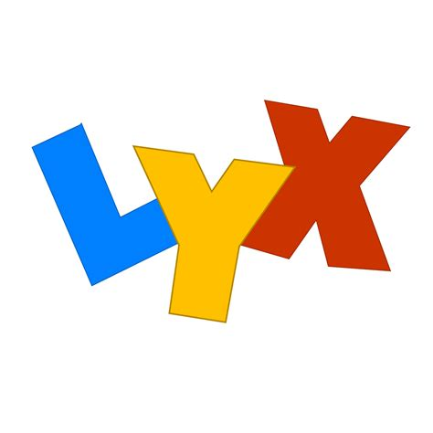

# Templates of Capstone Project Report (PFE)
 

 
LaTeX/LyX templates for end-of-studies project reports (*Projet de Fin d'Études*) at the Electrical Engineering Department of [ISET Bizerte](https://www.isetbz.rnu.tn/). Two versions are provided: one in **French** and one in **English**.
 
## Repository Structure
 
```
upfe/
├── fr-rapport/   # French report template (Rapport PFE)
└── en-report/    # English report template (Capstone Project Report)
```
 
## Getting Started
 
### Install a LaTeX Distribution
 
Download and install [**MikTeX**](https://miktex.org/), which provides the full LaTeX engine and package manager for Windows, macOS, and Linux.
 
> [!TIP]
> During first use, MikTeX will automatically download any missing packages on the fly.
 
### Install the Recommended Tools
 
| Tool | Purpose | Link |
|------|---------|------|
| **LyX** | WYSIWYG document editor for LaTeX | [lyx.org](http://www.lyx.org/) |
| **JabRef** | Bibliography / reference manager | [jabref.org](http://www.jabref.org/) |
| **Sumatra PDF** | Lightweight PDF viewer (supports auto-reload) | [sumatrapdfreader.org](https://www.sumatrapdfreader.org/) |
 
### Open the Template
 
- Launch **LyX** and open either `fr-rapport/` or `en-report/` depending on the language of your report.
- Export to PDF via **File → Export → PDF (pdflatex)**.
## License
 
This project is licensed under the [MIT License](LICENSE).
