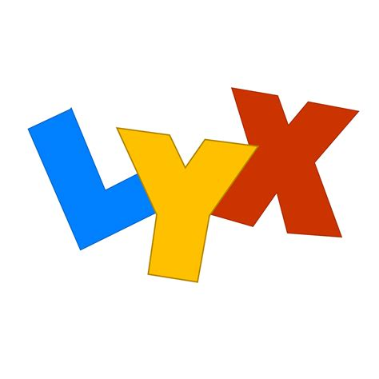

# Templates of Capstone Project Report 

## Installation

Download the binaries from [ProText](https://www.tug.org/protext/) or [MikTeX](https://miktex.org/) to install LaTeX distribution.

**LyX** The Document Processor:

-   _WYSIWYG Document Editor:_ [LyX](http://www.lyx.org/ "Link to LyX")

**JabRef** to manage bibliography DB through semi wysiwyg editors:

-   _Bibliography Manager:_ [JabRef](http://www.jabref.org/ "Link to JabRef")
